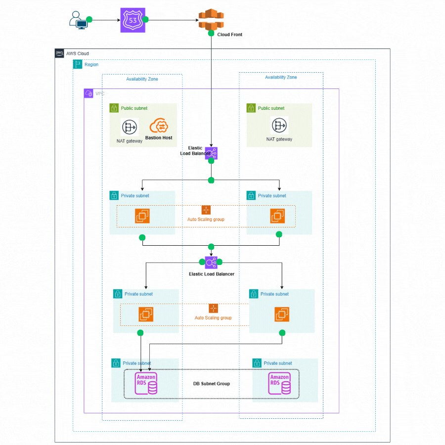
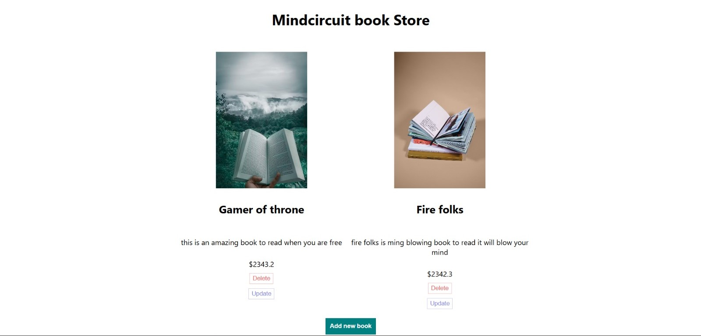

# AWS 3-Tier Architecture using Terraform

This project provisions a **Basic 3-Tier Architecture** in AWS using Terraform.

---

# 🏗 Architecture Overview

## Architecture Diagram



### Traffic Flow

Internet → Proxy Server → Application Server → RDS Database

---

# 📦 Infrastructure Components

## 1️⃣ VPC

- CIDR: `170.20.0.0/16`
- DNS Hostnames Enabled

📸 Screenshot:


---

## 2️⃣ Subnets

## Subnet Design

| Subnet Type | CIDR | Availability Zone | Purpose |
|-------------|------|------------------|---------|
| Public Subnet 1 | 170.20.1.0/24 | us-east-1a | Load Balancer / Proxy |
| Public Subnet 2 | 170.20.2.0/24 | us-east-1b | Load Balancer / Proxy |
| Private Frontend 1 | 170.20.3.0/24 | us-east-1a | Web Server |
| Private Frontend 2 | 170.20.4.0/24 | us-east-1b | Web Server |
| Private Backend 1 | 170.20.5.0/24 | us-east-1a | Application Server |
| Private Backend 2 | 170.20.6.0/24 | us-east-1b | Application Server |
| Private DB 1 | 170.20.7.0/24 | us-east-1a | Database (RDS) |
| Private DB 2 | 170.20.8.0/24 | us-east-1b | Database (RDS) |


---

## 3️⃣ Internet Gateway

Allows public internet access for proxy server.

---

## 4️⃣ NAT Gateway

Allows private subnet instances to access the internet securely.

---

## 5️⃣ EC2 Instances (t3.micro)

- Proxy Server (Public Subnet)
- Application Server (Private Subnet)

---

## 6️⃣ RDS Database (MySQL)

- Instance Type: `db.t3.micro`
- Not Publicly Accessible
- Accessible only from App server

---

# 🔐 Security Architecture

- Proxy allows HTTP (80) and SSH (22) from Internet
- App allows traffic only from Proxy Security Group
- RDS is not publicly accessible

---

# output




# How to Run the Project

### Clone the repository

```
[git clone https://github.com/Harinath234/three-tier-project-terraform.git]
cd three-tier-project-terraform.git
```

### Initialize Terraform

```
terraform init
```

### Review the execution plan

```
terraform plan
```

### Apply the infrastructure

```
terraform apply
```

Type **yes** when prompted.

---
